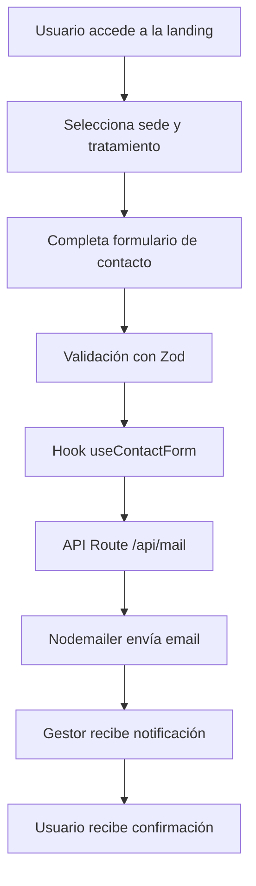

# 🏥 Insalud - Plataforma de Landing Pages Médicas

Una plataforma web moderna desarrollada con **Next.js 15** para **Insalud**, red de centros médicos especializados en salud sexual en Ecuador. El proyecto implementa un sistema de landing pages dinámicas para diferentes sedes y tratamientos médicos especializados.

## 🌟 Características Principales

- **🏢 Multi-sede**: Soporte para múltiples ubicaciones (Quito, Guayaquil)
- **💉 Multi-tratamiento**: Páginas especializadas para VPH, Ondas de Choque, Prostatitis
- **📱 Responsive**: Diseño completamente adaptativo para móviles y desktop
- **⚡ Performance**: Optimizado con Next.js 15 y Turbopack
- **📧 Sistema de Leads**: Integración completa de formularios con notificaciones por email
- **🎨 UI Moderna**: Interfaz construida con Tailwind CSS v4 y componentes reutilizables
- **🔧 TypeScript**: Desarrollo type-safe con validaciones robustas

## 🚀 Tecnologías y Stack

### Frontend
- **Next.js 15** - Framework React con App Router
- **React 19** - Biblioteca de interfaz de usuario
- **TypeScript 5** - Tipado estático
- **Tailwind CSS v4** - Framework de estilos utility-first

### UI/UX
- **Radix UI** - Componentes accesibles y sin estilos
- **Lucide React** - Iconografía moderna
- **GSAP** - Animaciones avanzadas
- **Sonner** - Notificaciones toast elegantes

### Formularios y Validación
- **React Hook Form** - Manejo eficiente de formularios
- **Zod** - Validación de esquemas TypeScript-first
- **Hookform Resolvers** - Integración entre RHF y Zod

### Backend/API
- **Nodemailer** - Envío de correos electrónicos
- **SMTP** - Configuración personalizada de email

### Estado y Utilidades
- **Zustand** - Manejo de estado global ligero
- **Class Variance Authority** - Variantes de componentes tipadas
- **clsx** - Utilidad para clases CSS condicionales

## 📁 Estructura del Proyecto

```
insalud-ecuador/
├── 📄 README.md                    # Documentación principal
├── 📄 package.json                 # Dependencias y scripts
├── 📄 next.config.ts              # Configuración Next.js
├── 📄 tsconfig.json               # Configuración TypeScript
├── 📄 components.json             # Configuración shadcn/ui
├── 📄 eslint.config.mjs           # Configuración ESLint
├── 📄 postcss.config.mjs          # Configuración PostCSS
│
├── 📂 src/
│   ├── 📂 app/                    # App Router de Next.js
│   │   ├── 📄 layout.tsx          # Layout raíz
│   │   ├── 📄 page.tsx            # Página principal (redirect)
│   │   │
│   │   ├── 📂 api/                # API Routes
│   │   │   └── 📂 mail/
│   │   │       └── 📄 route.ts    # Endpoint de envío de emails
│   │   │
│   │   ├── 📂 components/         # Componentes específicos de páginas
│   │   │   ├── 📄 AboutDevice.tsx
│   │   │   ├── 📄 AppointmentCta.tsx
│   │   │   ├── 📄 Footer.tsx
│   │   │   ├── 📄 NavigationSection.tsx
│   │   │   ├── 📄 Questions.tsx
│   │   │   ├── 📄 TestimonialBubbles.tsx
│   │   │   ├── 📂 hero-1/
│   │   │   ├── 📂 hero-2/
│   │   │   └── 📂 Treatment/
│   │   │
│   │   └── 📂 [sedes]/           # Rutas dinámicas por sede
│   │       ├── 📂 quito/         # Sede Quito
│   │       └── 📂 guayaquil/     # Sede Guayaquil
│   │           ├── 📄 layout.tsx # Layout por sede
│   │           ├── 📂 vph/       # Tratamiento VPH
│   │           ├── 📂 ondas-de-choque/  # Ondas de Choque
│   │           └── 📂 prostatitis/      # Prostatitis
│   │
│   ├── 📂 components/             # Componentes reutilizables
│   │   └── 📂 ui/                # Componentes UI base
│   │       ├── 📄 AccordionItem.tsx
│   │       ├── 📄 button.tsx
│   │       ├── 📄 FloatingWhatsApp.tsx
│   │       ├── 📄 form.tsx
│   │       ├── 📄 input.tsx
│   │       ├── 📄 label.tsx
│   │       ├── 📄 radio-group.tsx
│   │       ├── 📄 select.tsx
│   │       └── 📄 sonner.tsx
│   │
│   ├── 📂 data/                  # Datos estáticos
│   │   ├── 📂 questions/         # Preguntas frecuentes
│   │   │   ├── 📄 questionDisfuncion.ts
│   │   │   ├── 📄 questionProstatitis.ts
│   │   │   └── 📄 questionVph.ts
│   │   └── 📂 sedes/            # Configuración de sedes
│   │       ├── 📄 quito.ts
│   │       └── 📄 guayaquil.ts
│   │
│   ├── 📂 hooks/                 # Custom hooks
│   │   └── 📄 useContactForm.ts  # Hook para formularios de contacto
│   │
│   ├── 📂 lib/                   # Utilidades y configuraciones
│   │   ├── 📄 constants.ts       # Constantes globales
│   │   └── 📄 utils.ts          # Funciones utilitarias
│   │
│   ├── 📂 schemas/               # Esquemas de validación
│   │   └── 📄 index.ts          # Esquemas Zod
│   │
│   ├── 📂 styles/               # Estilos globales
│   │   └── 📄 globals.css       # CSS global con Tailwind
│   │
│   ├── 📂 types/                # Definiciones de tipos
│   │   └── 📄 index.ts         # Tipos TypeScript
│   │
│   └── 📂 utils/               # Utilidades específicas
│       └── 📄 cdn.ts          # Configuración CDN
```

## 🛠️ Instalación y Configuración

### Prerrequisitos

- **Node.js** 18.17+ 
- **npm** o **yarn** o **pnpm**
- **Git**

### 1. Clonar el Repositorio

```bash
git clone https://github.com/tu-organizacion/insalud-ecuador.git
cd insalud-ecuador
```

### 2. Instalar Dependencias

```bash
npm install
# o
yarn install
# o
pnpm install
```

### 3. Configurar Variables de Entorno

Crea un archivo `.env.local` en la raíz del proyecto:

```env
# SMTP Configuration para Nodemailer
SMTP_HOST=smtp.gmail.com
SMTP_PORT=465
SMTP_USER=tu-email@insalud.ec
SMTP_PASS=tu-app-password

# Next.js Configuration
NEXT_PUBLIC_CDN_URL=https://cdn.insalud.ec
NEXT_PUBLIC_SITE_URL=https://insalud.ec

# Analytics (opcional)
NEXT_PUBLIC_GA_TRACKING_ID=G-XXXXXXXXXX
```

### 4. Ejecutar en Desarrollo

```bash
npm run dev
# o
yarn dev
# o
pnpm dev
```

La aplicación estará disponible en `http://localhost:3000`

## 🎯 Scripts Disponibles

```bash
# Desarrollo con Turbopack (recomendado)
npm run dev

# Build de producción
npm run build

# Ejecutar en producción
npm run start

# Linting
npm run lint
```

## 🏗️ Arquitectura del Sistema

### Flujo de Datos



### Gestión de Sedes y Tratamientos

Cada sede tiene su propia configuración en `/src/data/sedes/`:

```typescript
// Ejemplo: quito.ts
export const quitoData = {
  name: "Quito",
  city: "Quito", 
  country: "Ecuador",
  address: "Av. 10 de Agosto N24-253",
  phone: "+593 98 765 4321",
  email: "contacto.citas@insalud.ec",
  landings: {
    vph: {
      gestor: "Misael",
      email: "gestor.citas5@insalud.pe",
      whatsapp: "969447773",
      message: "¡Hola! Vi su landing de tratamiento para eliminación de verrugas por VPH..."
    }
    // ... otros tratamientos
  }
}
```

### Validación de Formularios

Sistema robusto con Zod y React Hook Form:

```typescript
// schemas/index.ts
export const formLeadsSchema = z.object({
  nombres: z.string().min(1, { message: "El nombre es requerido" }),
  telefono: z.string()
    .min(10, { message: "Debe tener 10 dígitos" })
    .max(10, { message: "Debe tener 10 dígitos" })
    .regex(/^09\d{8}$/, { message: "Debe iniciar con 09 (celular ecuatoriano)" }),
  turno: z.string().min(1, { message: "El turno es requerido" }),
})
```

## 🎨 Sistema de Diseño

### Colores Principales

```css
/* Paleta Insalud */
--color-in-cyan: #EDFBFB;       /* Cyan claro */
--color-in-blue: #004569;       /* Azul principal */
--color-in-cyan-base: #00BEB4;  /* Cyan base */
--color-in-orange: #FFB531;     /* Naranja CTA */
--color-in-orange-hover: #E6A02C; /* Naranja hover */
```

### Tipografía

- **Nunito**: Títulos y headings
- **Poppins**: Textos secundarios
- **Roboto**: Textos de cuerpo

### Responsive Design

- **Mobile First**: Diseño prioritario para móviles
- **Breakpoints**: Siguiendo estándares de Tailwind CSS
- **Touch Friendly**: Botones y elementos táctiles optimizados

## 📧 Sistema de Notificaciones

### Configuración SMTP

El sistema utiliza **Nodemailer** con configuración SMTP personalizada:

```typescript
const transporter = nodemailer.createTransporter({
  host: process.env.SMTP_HOST,
  port: parseInt(process.env.SMTP_PORT || '465'),
  secure: true,
  auth: {
    user: process.env.SMTP_USER,
    pass: process.env.SMTP_PASS,
  }
});
```

### Template de Email

Los emails incluyen:
- **Información del paciente** (nombre, teléfono, turno)
- **Datos del gestor asignado**
- **Detalles del lead** (fecha, hora, página origen)
- **Diseño responsive** con branding de Insalud

## 🔐 Validación y Seguridad

### Validación del Lado del Cliente
- **Zod schemas** para tipado y validación
- **React Hook Form** para UX optimizada
- **Mensajes de error** contextuales en español

### Validación del Lado del Servidor
- **Validación doble** en API routes
- **Sanitización** de datos de entrada
- **Rate limiting** (recomendado implementar)

### Seguridad SMTP
- **Variables de entorno** para credenciales
- **Conexiones seguras** (SSL/TLS)
- **Validación de destinatarios**

## 🌐 SEO y Performance

### Meta Tags Optimizados

```typescript
export const metadata: Metadata = {
  title: "Insalud Ecuador",
  description: "Red de centros de salud especializados...",
  keywords: "centro médico quito, hospital quito, servicios médicos ecuador...",
  openGraph: {
    title: "Insalud Ecuador",
    description: "Red de centros de salud especializados...",
    type: "website",
    locale: "es_EC",
  },
}
```

### Optimizaciones de Performance
- **Next.js 15** con App Router
- **Turbopack** para desarrollo rápido
- **Imágenes optimizadas** con Next/Image
- **Lazy loading** automático
- **Tree shaking** de dependencias

## 🧪 Testing (Recomendado)

### Configuración Sugerida

```bash
# Dependencias de testing
npm install --save-dev jest @testing-library/react @testing-library/jest-dom
npm install --save-dev @types/jest jest-environment-jsdom
```

### Estructura de Tests

```
src/
├── __tests__/
│   ├── components/
│   ├── hooks/
│   ├── pages/
│   └── utils/
├── jest.config.js
└── jest.setup.js
```

## 🚀 Deployment

### Vercel (Recomendado)

```bash
# Instalar Vercel CLI
npm install -g vercel

# Deploy
vercel

# Deploy a producción
vercel --prod
```

### Variables de Entorno en Producción

Asegúrate de configurar en tu plataforma de deployment:

- `SMTP_HOST`
- `SMTP_PORT` 
- `SMTP_USER`
- `SMTP_PASS`
- `NEXT_PUBLIC_CDN_URL`
- `NEXT_PUBLIC_SITE_URL`

### Build Commands

```bash
# Build
npm run build

# Start (producción)
npm run start
```

## 🔧 Configuración Adicional

### ESLint

El proyecto incluye configuración ESLint para mantener calidad de código:

```javascript
// eslint.config.mjs
import { FlatCompat } from "@eslint/eslintrc";

const compat = new FlatCompat({
  baseDirectory: import.meta.dirname,
});

const eslintConfig = [
  ...compat.extends("next/core-web-vitals", "next/typescript"),
];

export default eslintConfig;
```

### PostCSS

Configurado para Tailwind CSS v4:

```javascript
// postcss.config.mjs
const config = {
  plugins: {
    '@tailwindcss/postcss': {},
  },
}

export default config
```

## 📱 Integración WhatsApp

### Componente FloatingWhatsApp

```typescript
<FloatingWhatsApp
  phoneNumber={jesusMariaData.landings.vph.whatsapp}
  message={jesusMariaData.landings.vph.message}
  tooltipText="¡Conversemos por WhatsApp!"
/>
```

### Mensajes Personalizados

Cada sede y tratamiento tiene mensajes predefinidos optimizados para conversión.

## 🔄 Flujo de Desarrollo

### Gitflow Recomendado

```bash
# Feature branch
git checkout -b feature/nueva-sede-huancayo
git add .
git commit -m "feat: añadir nueva sede Huancayo"
git push origin feature/nueva-sede-huancayo

# Pull request y merge a main
```

### Commits Semánticos

- `feat:` nueva funcionalidad
- `fix:` corrección de bugs
- `docs:` documentación
- `style:` cambios de estilo
- `refactor:` refactorización
- `test:` añadir tests
- `chore:` tareas de mantenimiento

## 🤝 Contribución

### Añadir Nueva Sede

1. Crear archivo en `/src/data/sedes/nueva-sede.ts`
2. Añadir carpeta en `/src/app/nueva-sede/`
3. Crear layouts y páginas de tratamientos
4. Actualizar tipos en `/src/types/index.ts`
5. Actualizar constantes en `/src/lib/constants.ts`

### Añadir Nuevo Tratamiento

1. Crear preguntas en `/src/data/questions/`
2. Añadir constantes en `/src/lib/constants.ts`
3. Crear página en cada sede
4. Actualizar configuración de gestores

## 📞 Soporte y Contacto

- **Email Técnico**: desarrollo@insalud.ec
- **Email Comercial**: contacto.citas@insalud.ec
- **WhatsApp**: +593 98 765 4321

## 📄 Licencia

Este proyecto es propiedad de **Insalud Ecuador** y está protegido por derechos de autor. Todos los derechos reservados.

## 🔄 Changelog

### v0.1.0 (Actual)
- ✅ Implementación inicial con Next.js 15
- ✅ Sistema multi-sede (Quito, Guayaquil)
- ✅ Tratamientos: VPH, Ondas de Choque, Prostatitis
- ✅ Sistema de formularios con validación
- ✅ Integración completa de email
- ✅ WhatsApp flotante personalizado
- ✅ Diseño responsive completo

### Roadmap v0.2.0
- 🔮 Sistema de analíticas avanzadas
- 🔮 A/B testing para CTAs
- 🔮 Chat en vivo
- 🔮 Sistema de citas online
- 🔮 Panel administrativo
- 🔮 Multi-idioma (Quechua)

---

**Desarrollado con ❤️ para Insalud Ecuador**

*Transformando la atención médica especializada en Ecuador mediante tecnología de vanguardia.*
